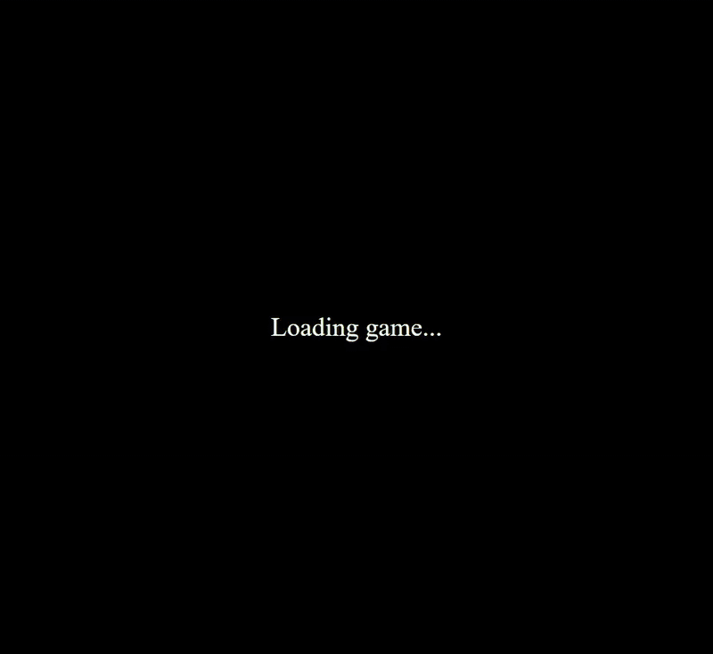

# Catch The Goblin Game



Originally inspired by a game I stumbled across on [gameee.vercel.app](https://gameee.vercel.app), this project enhances and completes the foundation left by the original. The goal was to provide a cleaner and more polished gameplay experience.

[**Play Catch The Goblin on Vercel**](https://catch-the-goblin.vercel.app/)

## About the Game
**Catch The Goblin** is a simple game that challenges players to capture goblins on-screen. As the game progresses, goblins appear at random locations, keeping players on their toes. The objective is straightforward but fun: **Catch as many goblins as you can!**

### Key Features:
- **Responsive Gameplay**: Works smoothly on desktop.
- **Enhanced Background Design**: Edited background image to make trees appear larger.
- **Pixel-Perfect Rendering**: Ensures crisp graphics on all devices.
- **Centered Display and Screen Fit**: Optimized to fit any screen size without losing quality.
- **Fullscreen Mode**: Easily toggle fullscreen mode for an immersive experience.
- **Loading Screen**: Displays a loading screen while assets load for a smoother experience.
- **Collision Walls Around Obstacles**: Hero and goblin are blocked by trees.
- **Smooth Animations and Controls**: Runs at 60fps with responsive keyboard controls.

### Future Improvements:
- **Touch Controls for Mobile**: Planned addition of touch buttons to enable mobile gameplay.

## How to Use

To run **Catch The Goblin** locally:

1. **Clone the Repository**:
   Open a terminal and run:
   ```bash
   git clone https://github.com/Glooring/catch-the-goblin.git
   ```

2. **Navigate to the Project Folder**:
   ```bash
   cd catch-the-goblin
   ```

3. **Open `index.html`**:
   - Locate the `index.html` file inside the project folder.
   - Open it directly in your browser by double-clicking the file or right-clicking and selecting "Open With" -> "Your Preferred Browser."
   - You should now see the **Catch The Goblin** game load in your browser.

4. **Enjoy the Game**:
   - To enter fullscreen mode, press **F11**.
   - Use keyboard controls to capture goblins and see how high of a score you can achieve!
   
### Run the Game as a Desktop Application

**Catch The Goblin** is also available as a standalone `.exe` file, built with [Tauri](https://tauri.app), which provides a lightweight and fast native experience.

1. **Download the `.exe`**:
   - Download the latest release from the [Releases](https://github.com/Glooring/catch-the-goblin/releases) page or directly using [this link](https://github.com/Glooring/catch-the-goblin/releases/download/v1.0.0/catch-the-goblin.zip).

2. **Extract and Run**:
   - Extract the `.zip` file.
   - Double-click `catch-the-goblin.exe` to start the game.

The Tauri-built `.exe` offers a compact, standalone version of the game without needing a browser.